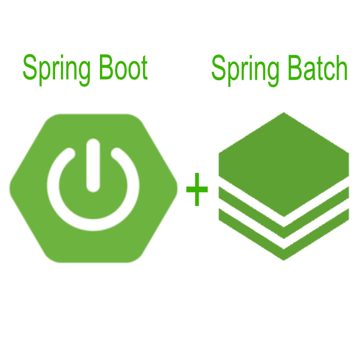
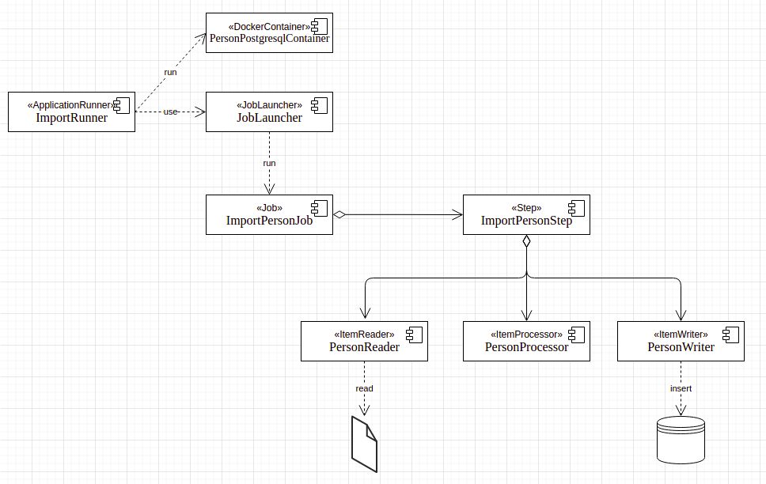
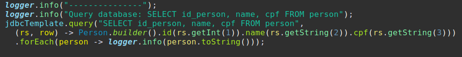
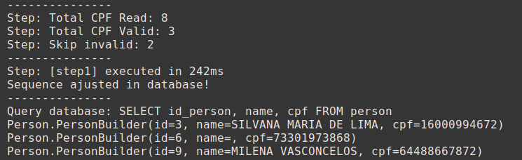

  

# Spring Batch Application

Developed by 

If you want, read the reference documentation about [Spring Batch](https://docs.spring.io/spring-batch/docs/current/reference/html/index.html)

## About the application

This repository contains an example application using the Spring batch framework. 
The purpose of the application is:
* Read a TXT file that contains three fields separated by commas in each line
* Do the necessary validation of the information. 
* For this application it was defined as valid CPF only even numbers.
* Import the data into the Postgres database.
* For test purpose, Postgres run embedded inside the docker container. So, no data is persisted across executions.

## Developed With

* **Spring Boot / Spring Batch** Framework to processing TXT file and import to database.
* Database **PostgreSQL** to store the data.
* **Docker** to package and run applications inside a container.
* **Flyway** Database Migration Tool to create the necessary tables in the database.
* **Maven** as Dependency Management System, and **Lombok Java library** to improve productivity.
* **Eclipse** as IDE.

## Application components

* The following illustration shows the different components this Application Spring Batch and how they are connected with each other.

  

## File TXT format

The text file to import must have three fields separated by comma as follow:
  * ID: sequential number that will be the primary key in the database.
  * NAME: string.
  * CPF: 11 character number.

## How to run application using Docker
* If you don't have Docker, please install Docker:
[Docker Desktop](https://docs.docker.com/get-docker/) or [Docker basics for Amazon ECS](https://docs.aws.amazon.com/AmazonECS/latest/userguide/docker-basics.html).
* Create new TXT file or copy a file that already exists.
* Run on the terminal:

`sudo docker pull projetquebec/projetquebec:0.0.1-SNAPSHOT`

`docker run -v <FileFullPathName>:/cpfs.txt -v /var/run/docker.sock:/var/run/docker.sock projetquebec/projetquebec:0.0.1-SNAPSHOT cpfs.txt`

Attention! You must pass the file with the "full pathname" in the first parameter "-v". (If necessary, use sudo in Linux). You have to change only the parameter <FileFullPathName>. The rest of the command does not change.

Example:

`docker run -v /home/usuario/importCpf/list-cpf.txt:/cpfs.txt -v /var/run/docker.sock:/var/run/docker.sock projetquebec/projetquebec:0.0.1-SNAPSHOT cpfs.txt`

## Results

* At the end of the batch file process, a query is made in the database table to verify the result:

  

* The final result of the process is listed in the application log as follows:

  

## How to develop
* You will need a Windows or Linux with Java/OpenJDK.
* Application is using Maven, so all required libraries should be downloaded automatically.
* Clone the git repository using the URL on the Github home page:

`$ git clone git@github.com:ralexandre11/ImportCpf.git`

`$ cd ImportCpf`

* To buid the image Docker, use the command:

`$ mvn package`

* use the docker command to run in the topic above.

* To run just type the command below at your terminal:

## dockerhub
https://hub.docker.com/repository/docker/projetquebec/projetquebec
