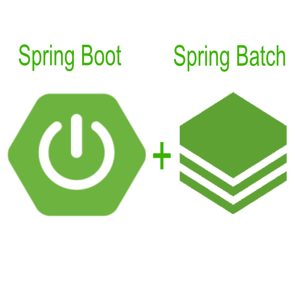

  

# Spring Batch Application

Developed by 

If you want, read the reference documentation about [Spring Batch](https://docs.spring.io/spring-batch/docs/current/reference/html/index.html)

## About the application

This repository contains an example application using the Spring batch framework. 
The purpose of the application is:
* Read a TXT file that contains three fields separated by commas in each line
* Do the necessary validation of the information
* Import the data into the Postgres database.
* For test purpose, Postgres run embedded inside the docker container. So, no data is persisted across executions.

### Developed With

* **Spring Boot / Spring Batch** Framework to processing TXT file and import to database.
* Database **PostgreSQL** to store the data.
* **Docker** to package and run applications inside a container.
* **Flyway** Database Migration Tool to create the necessary tables in the database.
* **Maven** as Dependency Management System, and **Lombok Java library** to improve productivity.
* **Eclipse** as IDE.

## File TXT format

The text file to import must have three fields separated by comma as follow:
  * ID: sequential number that will be the primary key in the database.
  * NAME: string.
  * CPF: 11 character number.

## How to run

* You will need a Windows or Linux with Java/OpenJDK.
* Application is using Maven, so all required libraries should be downloaded automatically.
* If you don't have Docker, please [install Docker](https://docs.aws.amazon.com/AmazonECS/latest/userguide/docker-basics.html)
* Run application using Docker

`sudo docker run -v /home/ec2-user/importcpf/list-cpf.txt:/cpfs.txt -v /var/run/docker.sock:/var/run/docker.sock projetquebec/projetquebec:0.0.1-SNAPSHOT cpfs.txt`

* Run application using Docker in AWS

`sudo docker run -v /home/ec2-user/importcpf/list-cpf.txt:/cpfs.txt -v /var/run/docker.sock:/var/run/docker.sock projetquebec/projetquebec:0.0.1-SNAPSHOT cpfs.txt`

## How to develop

* Clone the git repository using the URL on the Github home page:

`$ git clone git@github.com:ralexandre11/ImportCpf.git`

`$ cd ImportCpf`

* Buid the image Docker

`$ mvn package`

* To run just type the command below at your terminal:

`$ java -jar <JAR_FILE> <TEXT_FILE>`

Run with a project test file:

`java -jar target/ImportCpf-0.0.1-SNAPSHOT.jar src/main/resources/list-cpf.txt`

   

<!-- USAGE EXAMPLES -->
## Usage

To run just type the command below at your terminal:

`java -jar <JAR_FILE> <TEXT_FILE>`

Ex:`java -jar target/ImportCpf-0.0.1-SNAPSHOT.jar person.txt`

### Run with docker

#### dockerhub
https://hub.docker.com/repository/docker/projetquebec/projetquebec

